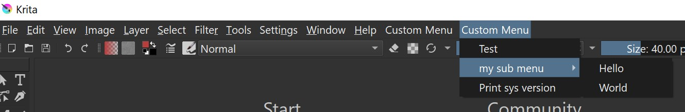
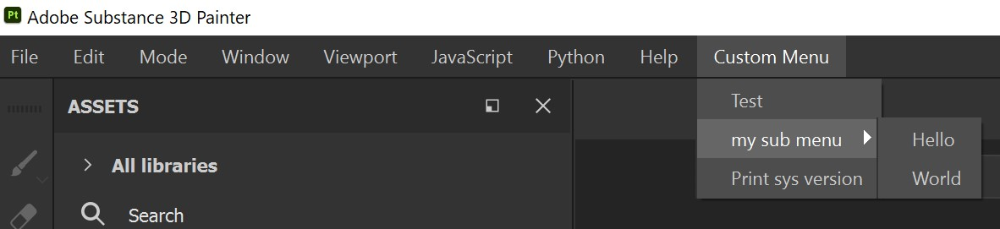

# UniMenu (Universal Menu)

<!---[](https://coveralls.io/github/hannesdelbeke/unimenu?branch=main)-->

[](https://pypi.org/project/unimenu/)
[](https://github.com/hannesdelbeke/unimenu/wiki)

A pure python module to add python commands to the menu.

Supports Unreal Engine, Blender, Marmoset<br>
and any app that uses QT: Maya, Krita, Substance Painter, 3ds Max, FreeCAD, CryEngine ...

For more info read the [wiki](https://github.com/hannesdelbeke/unimenu/wiki)

   

# how to use

you can make your menu(s):
- from a config
- from a dict
- with explicit code
- from a folder of scripts

### load from config (YAML & JSON)
```yaml
items:
  - label: my menu
    items:
      - label: my item
        command: print("Hello World")
```
```python
import unimenu
config_path = "path/to/config.yaml"
unimenu.setup(config_path)
```

### load from dynamic dict

```python
import unimenu
data = {"items": [{"label": test,"command": 'print("hello world")'}]}
unimenu.setup(data)
```


### with code

```python
import unimenu.apps.blender

menu = unimenu.dccs.blender.MenuNodeBlender(label="my submenu")  # create a submenu, parent defaults to the menu bar
item = unimenu.dccs.blender.MenuNodeBlender(label="hello", command='print("hello world")',
                                            parent="UNIMENU_MT_my_submenu")  # add menu item to our submenu
menu.items.append(item)  # add the item to the submenu
menu.setup()  # setup the menu
```

### from a folder of scripts (module) (experimental, needs updating)

great for a folder full of tools that need launching when clicking a button.
1. ensure the folder is importable (in the sys.path)
2. create a menthod in all submodules with the same name, e.g. def show()
```python
import unimenu
unimenu.module_setup('name_of_folder', function_name='show', menu_name="My tools")
```


## When to use

some software e.g. Unity & Maya already have good ways to make custom menus. If you only use 1 software and find it easy to make a menu, you don't need unimenu.

The power of this module comes from standardising menu creation across multiple software. Great for studio-pipelines with several programs.
Unimenu makes menu creation less complex, e.g. in Blender.

## Notes
- support loading multiple configs. Great for a single studio config and several project configs. Or a team config.
- support creating another config to a previously created menu, or submenu!

## Supports
unimenu was tested in the following versions, and might work in other versions.
- Unreal 5.0.2
- Blender 3.2, 2.93, 2.8 (minimum)
- Maya 2023, 2022 (minimum)
- Substance Painter 8.2.0
- Max 2024
- Marmoset 3.08

python 3.7+ due to f-strings and pathlib

## Development

main platform is windows, would be interested to hear from mac & linux users.

feel free to create a PR to help out.

to add support for your favorite software, add a python module named after the software with a setup_menu function
where possible stick to the windows menu [design guidelines](https://learn.microsoft.com/en-us/previous-versions/windows/desktop/bb226797(v=vs.85))
