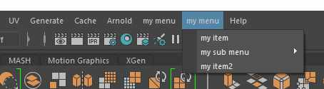

# unreal_menu
A pure python helper module to add python commands to the unreal engine 5 menu.


# how to use

create your config in yaml
```yaml
parent_menu: LevelEditor.MainMenu
items:
  - name: my menu
    items:
      - name: my item
        command: print("Hello World")
```
or json
```json
{
   "parent_menu":"LevelEditor.MainMenu",
   "name":"my menu",
   "items":[
      {
         "name":"my item",
         "command":"print(\"Hello World\")"
      },
      {
         "name":"my sub menu",
         "items":[
            {
               "name":"sub item 1",
               "command":"print(\"Hello World\")"
            }
         ]
      }
   ]
}     
```
run this to create your unreal menu from the config
```python
import unreal_menu
unreal_menu.setup(config_path)
```

## Notes
- support loading multiple configs. Great for a single studio config and several project configs. Or a team config.
- support creating another config to a previously created menu, or submenu!
- setup autoload on startup with [init_unreal.py](https://docs.unrealengine.com/4.27/en-US/ProductionPipelines/ScriptingAndAutomation/Python/#theinit_unreal.pyfile)
